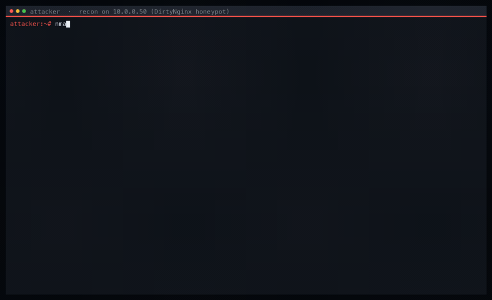

# DirtyNginx — Honeypot Redis & Nginx

🇫🇷 **Français** · [🇬🇧 English](README.en.md)

Script de déploiement qui transforme un hôte Ubuntu en **honeypot trompeur** :
une fausse base **Redis** et un serveur **Nginx** qui annonce de vieux logiciels
« vulnérables ». Un attaquant qui le scanne trouve des cibles juteuses et une base
exposée — le tout factice, le tout journalisé.

## Démo — ce que voit un attaquant



Recon contre le honeypot : bannières usurpées (**Symfony 2.7 / PHP 5.4.0**, Apache,
Varnish) et un **Redis** « exposé » rempli de fausses données e-commerce. Chaque
bannière est forgée et chaque enregistrement est un leurre — pendant ce temps, la
recon de l'attaquant est loggée.

## Vue d'ensemble

Le script met en place des services honeypot **Redis** et **Nginx** qui simulent
des systèmes vulnérables à des fins de surveillance et d'analyse.

## Fonctionnalités

1. **Installation automatisée** — installe et configure Redis, Nginx, OpenSSL.
2. **Honeypot Redis** — utilisateur de service isolé, fausses données
   utilisateurs/produits/commandes, commandes sensibles verrouillées, unité
   systemd durcie.
3. **Honeypot Nginx** — SSL auto-signé, plusieurs pages statiques & d'erreur API,
   et **faux en-têtes de versions vulnérables** (PHP, Varnish, Nginx, Symfony) ;
   intègre des balises JS vers des endpoints de tracking externes.
4. **Modules de déception** — intégration FortiDeceptor.
5. **Gestion des logs** — efface et remplace logs/historiques pour masquer les
   traces d'installation.

## Installation

```bash
su -
curl -s https://raw.githubusercontent.com/r648r/DirtyNginx/main/install.sh -o install.sh
bash install.sh
```

## Prérequis

- OS : `Ubuntu 20.04` ([pourquoi](https://docs.fortinet.com/document/fortideceptor/6.0.0/fortideceptor-customization-cookbook/89327/introduction))
- Accès Internet · privilèges root

> ⚠️ À déployer uniquement sur une infrastructure dont vous êtes responsable, à des fins défensives / de recherche.
